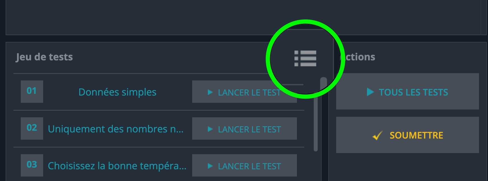

# Déboguez vos exercices Codingame depuis Visual Studio Code

## Comment ça marche ?

Sélectionnez un exercice sur le site codingame qui donne accès aux jeux de tests.

Vous pouvez accéder aux jeux de tests d'un exercice en cliquant sur l'icône suivante depuis l'éditeur de code :



Prenons par exemple l'exercice [Températures](https://www.codingame.com/ide/puzzle/temperatures).

1. Copiez le contenu du code de base en haut à droite de l'éditeur dans le fichier `codingame.js`
2. Sélectionnez le jeu de test de votre choix dans la liste puis copiez le contenu des entrées dans le fichier `entrees.txt`. Pour l'exemple on prendra le jeu de test 3 "Choisissez la bonne température" :


Votre fichier `codingame.js` doit maintenant ressembler à ça :

```js
// Ne supprimez pas la ligne ci-dessous
const readline = require('./readline');

// Indiquez le code de base fourni par codingame ci-dessous
/**
 * Auto-generated code below aims at helping you parse
 * the standard input according to the problem statement.
 **/

const n = parseInt(readline()); // the number of temperatures to analyse
var inputs = readline().split(' ');
for (let i = 0; i < n; i++) {
    const t = parseInt(inputs[i]);// a temperature expressed as an integer ranging from -273 to 5526
}

// Write an answer using console.log()
// To debug: console.error('Debug messages...');

console.log('result');
```

Votre fichier `entrees.txt` doit maintenant ressembler à ça :

```
6
42 -5 12 21 5 24
```

Rédigez votre code répondant à l'exercice.

Vous n'avez plus qu'à exécuter la configuration "Jouer les tests" (définie dans le fichier `.vscode/launch.json`) en appuyant sur `CTRL+F5` ou en faisant menu **Exécuter > Exécuter sans débogage** pour vérifier que votre code affiche la sortie attendue.

Si vous souhaitez déboguer votre code, il vous suffit de placer un point d'arrêt dans le code répondant à l'exercice puis de lancer le débogueur avec `F5` ou le menu **Exécuter > Démarrer le débogage**.

Profitez de la puissance du débogueur de VSCode pour déboguer votre exercice et réussir tous les tests !

# Formation algorithmique

Ce dépôt a été créé pour aider mes étudiants à apprendre l'algorithmique et devenir performant lors d'entretiens techniques pour décrocher un poste de développeur.

Si vous êtes intéressés par ma formation algorithmique, je vous invite à lire la page de présentation du [module algorithmique de ma formation](https://www.javascriptdezero.com/algorithmique).

N'hésitez pas à me contacter si vous avez des questions.
- Email : jeremy@javascriptdezero.com
- Twitter : [@jeremy](https://twitter.com/jeremymouzin)